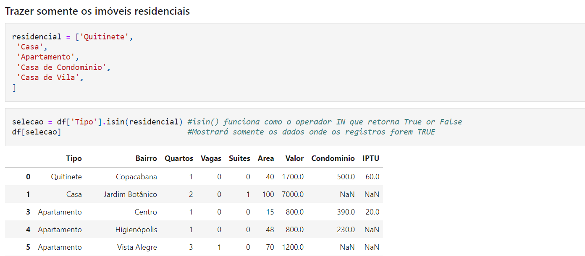
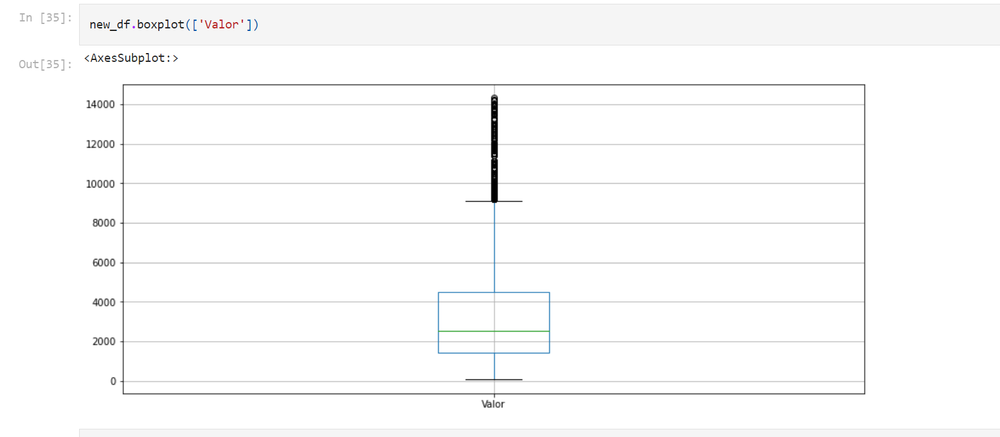

# Pandas: Básico

#### Notebook
- Caso deseje visualizar os codigos e entender mais sobre este assunto veja o notebook onde contem os códigos.

> Acesse o [notebook](https://github.com/zThanael/Estudo-sobre-DataScience/blob/main/Pandas/Panda%20b%C3%A1sico/Resumo.ipynb)

Este tópico de tratando e analisando dados é resultado do acompanhamento do curso ``Python Pandas: Tratando e analisando dados`` da **Alura**

No notebook foi demonstrado todo o processo para realizar um tratamento dos dados, passando por etapas primordiais como.

- *Importação dos dados.*
- *Filtros*
- *Limpeza dos dados faltantes e duplicados.*
- *Visualização dos OutLiers*
- *Remoção dos OutLiers*

# Etapas

- ### Importação dos dados.
Para realizar a importação destes dados, já tinhamos um arquivo csv, para realizarmos nossas tarefas, caso deseje saber mais sobre a importação de dados no pandas, acesse [Pandas: Formatos diferentes de entrada e saídas](https://github.com/zThanael/Estudo-sobre-DataScience/tree/main/Pandas/Pandas%20Input%20Output)

- ### Analise de dados.
Nesta etapa foram utilizadas os comandos de ``df.info()``,``df.shape``,``df.dtypes`` e ``df.describe()``, para visualizar os dados e entender melhor com o que estamos trabalhando, lembrando que existem muitos outrs metodos para realizar esta tarefa, mas estes foram os utilizados.

``df.info()``: seu retorno são informações gerais sobre o DataFrame como por exemplo as colunas, tipos de dados, e o mais importante ao meu ver, a contagem dos dados por coluna, onde podemos visualizar quantos dados **non-null** foram contados na coluna.

``df.shape``: Seu retorno é uma tupla com 2 valores, o primeiro é a quantidade de registros (linhas) do DataFrame enquanto que o outro é a quantidade de colunas do DataFrame

``df.dtypes``: Seu objetivo está em mostrar os tipos de dados das colunas do nosso DataFrame.

``df.describe()``: retorna um DataFrame com as principais informações estatisticas de cada coluna como por exemplo, a média, os quartis, desvio padrão, entre outras informações.

- ### Filtros.
Uma das maneiras de filtrar um dataframe é passando um array com valores booleanos para ele, de modo com que o pandas traga somente os valores Trues.
Exemplo:

    df[df['tipo'].isin(residencial)]

Uma boa pratica para filtrar dados ao meu ver e criar uma variavel chamada **selecao** que ira armazenar um array boolean, para quando utilizarmos no df, usarmos somente ``df[selecao]``

    selecao = (df['area'] >= 50) & (dados['area'] <= 100)
    df[selecao]

São infinitas as possibilidades de utilziarmos isso, para entender mais essas listas booleanas geradas é necessario entender sobre as Series do Pandas, que são a arrays numpy. 

No nosso [notebook](https://github.com/zThanael/Estudo-sobre-DataScience/blob/main/Pandas/Panda%20b%C3%A1sico/Resumo.ipynb) utilizamos isso para filtrar e trazer somente os imóveis residenciais, veja:

Ainda sobre filtros leia este [Artigo](https://medium.com/data-hackers/a-maneira-eficiente-de-filtrar-um-data-frame-pandas-4158a4e37c10) ele explica muito mais sobre os filtros no pandas.

- ### Limpeza dos dados.
Dentro do pandas para visualizar os dados nulos, existem duas funções muito úteis a ``isnull()`` e a ``notnull()`` ambas funcionam de maneira similar, na ``isnull()`` o retorno sera de um DataFrame booleano onde os valores True representam os dados nulos, já no ``notnull()`` é o contrario, ou seja, valores False representam nulos.
Outra maneira de visualizar os nulos é com o ``df.info()`` o qual foi explicado anteriormente.

##### Remover os dados nulos.
Para realizar a remoção destes dados utilizamos ``dropna()``, onde podemos passar por parametro quais as colunas que desejamos que tenha seus valores nulo deletadas, este parametro é o **subset = ['colunas']**
Podemos também simplesmente filtrar para que nao venham os valores nulos, utilizando os filtros.

##### Substituição dos valores nulos.
Outra coisa interessante é trocarmos os valores nulos por outro de nossa escolha, usamos o ``fillna()`` para isso.

- ### OutLiers
Os outliers são os valores que não se encaixam nos valores padrões do nosso DataFrame para visualizar eles precisamos plotar um boxplot (gráfico)
para isso devemos importar uma biblioteca
    
    import matplotlib.pyplot as plt

apos isso basta que criemos o gráfico.

    df.boxplot(['Coluna'])

- ### Removendo os OutLiers

Para realizar a remoção destes outliers precisamos reproduzir a seguinte formula presente na imagem:

- ## Observações
Gostaria de lembra-los que para entender melhor é necessário visualizar o  [notebook](https://github.com/zThanael/Estudo-sobre-DataScience/blob/main/Pandas/Panda%20b%C3%A1sico/Resumo.ipynb) onde todos os codigos são mostrados, assim facilitando o entendimento do conteúdo.
- Também existe um arquivo markdown com as anotações realizadas durante o curso, pode ser algo que venha a ajudar, para isso acesse as [Anotações](https://github.com/zThanael/Estudo-sobre-DataScience/blob/main/Pandas/Panda%20b%C3%A1sico/anota%C3%A7%C3%B5es.md)