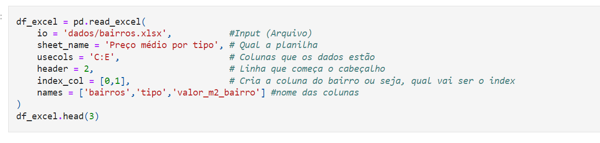

# Pandas: Formatos diferentes de entrada e saídas.

#### Notebook
- Caso deseje visualizar os codigos e entender mais sobre este assunto veja o notebook onde contem os códigos.

> Acesse o [notebook](https://github.com/zThanael/Estudo-sobre-DataScience/blob/main/Pandas/Pandas%20Input%20Output/Importando%20e%20exportando%20dados.ipynb)

Repositório para estudar e mostrar alguns dos principais dados com os quais o pandas pode trabalhar, como por exemplo:

- **csv**
- **excel**
- **json**
- **html**
- **sql**
- **txt**

> Caso queira ver todos os tipos de entradas acesse a [Documentação](https://pandas.pydata.org/docs/reference/io.html)

---

# Principais tipos dos dados.

- ### CSV
Arquivos com a extensão .csv são os mais utilizados dentro do pandas, para realizar a leitura destes arquivos basta que usemos.

    df_csv = pd.read_csv('arquivo.csv')

Em alguns casos a visualização ficara estranha de modo com que o dataframe fique tudo compacto por exemplo: 

Nestes casos precisamos utilizar o parametro ``sep = ';'`` , ficando da seguinte forma

- ### Excel
O interessante de se trabalhar com planilhas excel no pandas e que podemos passar os dados de diferentes meios, como por exemplo, passando a planilha toda, ou determinadas celulas.

> - Jeito simples:

    df_excel = pd.read_excel('arquivo.xlsx')

> - Jeito mais aprofundado:

Passamos diversos parametros neste caso, veja o exemplo: 

- ### JSON
Arquivos com a extensão .json geralmente são provindos de API's, para realizar a leitura destes arquivos bata que usemos.

    df_json = pd.read_json('arquivo.json')

Do mesmo modo que com os arquivos CSV, alguns arquivos JSON podem vir com uma formtação diferente dificultando a visualização, como por exemplo: 

Para resolver estes casos, vamos utilizar um método chamado de ``pd.json_normalize()``

Ao utilizar o normalize, obtemos um DataFrame somente com a coluna 'normal', mas ainda assim está dificil a visualização, então fazemos novamente o ``json_normalize``, mas desta vez vamos passar como **data** somente a primeira linha do DataFrame, e com o separador **_** 

> É um pouco confuso de entender, torna-se interessante visualizar seu arquivo json por meio de um  [json viewer](http://jsonviewer.stack.hu/), caso ainda assim fique confuso o uso do ``json_normalize`` acesse a [Documentação](https://pandas.pydata.org/docs/reference/api/pandas.json_normalize.html)

- ### HTML
Ao trabalhar com HTML no pandas podemos passar ele tanto por arquivo.html quanto por link de web-sites.

Obs: Ao trabalhar com html é necessário se atentar que o pandas por padrão nos trará o resultado dentro de um array.
> - Arquivos html

    df_html = pd.read_html('arquivo.html')

Para acessar este DataFrame precisamos fazer o seguinte ``df_html[0]``

> - WebSites

o Pandas quando passamos um link a um site, ele nos trará um array com todas as <table></table> que ele encontrar no site, ou seja se o site tiver 5 tabelas, teremos um array com 5 DataFrames.

- ### TXT
Por fim vamos realizar também a entrada de um arquivo .txt para transforma-lo em um DataFrame, sendo esa uma forma bem simples.

    df_txt = pd.read_table('arquivo.txt')

- ### SQL
Uma das maneiras que ao meu ver é muito útil é utilziar querys do banco (SQL) para transforma-las em um DataFrame, e para fazer isso  precisamos conectar a um banco de dados no notebook, segue um exemplo de como realizar essa conexão. 

feita a conexão podemos, basta criarmos uma query SQL e rodar da seguinte forma.

    df_sql = pd.read('SELECT * FROM table', con = engine)

este engine refere-se a conexao criada anteriormente, caso queria também pode passar o SQL dentro de uma variavel para ocupar menos espaço. 

#### Saida de um SQL.

Para realizar um insert no banco de dados por meio de um DataFrame, podemos usar o seguinte comando.

    df.to_sql('nome da tabela', con = engine) 

Deste modo é feito o insert em um banco de dados atraves do DataFrame, também podemos adicionar mais parametros.
    
    df.to_sql(
        'nome da tabela',
        con = engine,  
        if_exists = 'replace'
        index = False
        dtype = {'coluna': integer()}
    )

> Caso queria entender melhor todos esses parametros acesse a [Documentação](https://pandas.pydata.org/docs/reference/api/pandas.DataFrame.to_sql.html)

## Exportação de DataFrames.
Para realizar a exportação dos DataFrames, geralmente seguem a mesma lógica, onde o comando será ``df.to_extensão('nome do arquivo . extensão')``. Exemplos

- **JSON**: ``df.to_json('arquivo.json')``

- **CSV**:   ``df_to_csv('arquivo.csv')`` caso queira pode-se passar o sep também

- **TXT**: ``df.to_txt('arquivo.json')``

- **SQL**: Foi explicado logo acima a maneira de como inserir um DataFrame dentro de um banco de dados.